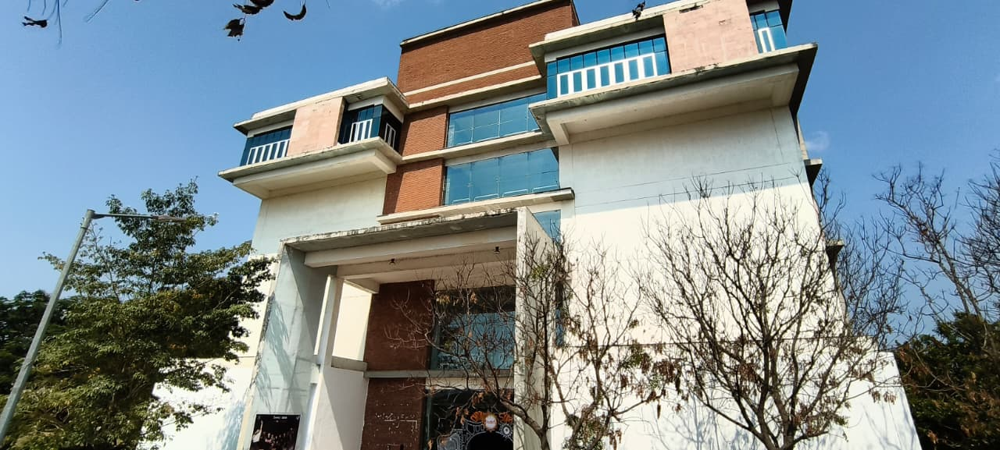
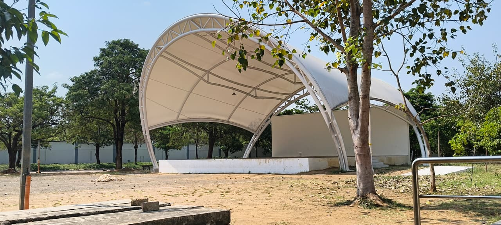

# 🏛️ IMAGIX – Image Processing Challenge
### SALVARA Fest | Past & Future Themes

---

## 📌 Theme: Past → Present → Future

This project transforms a **present-day building photograph** into two dramatically different interpretations:
- 🕰️ **Past** — A 1940s-era aged film photograph with sepia tones, grain, scratches, and worn borders
- 🚀 **Future** — A 2087 AI surveillance HUD scan with neon glows, holographic grids, and data overlays

---

## 🖼️ Source & Output Images

| Original (Present) | Past Theme | Future Theme |
|---|---|---|
|  |  |  |
|  |  |  |

---

## 🕰️ PAST THEME — "circa 1940s"

### Idea & Concept
The building is transported back to the **1940s** — rendered as if it were captured on an old film camera, hand-developed in a darkroom. The result mimics authentic aged photography with all its imperfections: yellowed paper, chemical grain, lens vignette, film scratches, and a handwritten caption strip at the bottom.

### Algorithms Used

| Step | Algorithm / Technique | Purpose |
|------|----------------------|---------|
| 1 | **Bicubic Upscale** (`cv2.resize`) | Process at 2x resolution for sharper detail |
| 2 | **Sepia Tone** (channel weighting) | Convert to classic sepia brown tone |
| 3 | **Channel Manipulation** (`cv2.split/merge`) | Add aged yellow-brown tint |
| 4 | **CLAHE** (`cv2.createCLAHE`) | Boost local contrast like old high-contrast film |
| 5 | **Gaussian Noise** (NumPy random) | Simulate analog film grain |
| 6 | **Distance Map Vignette** (NumPy `ogrid`) | Dark rounded edges like old camera lens |
| 7 | **Line & Circle Drawing** (`cv2.line`, `cv2.circle`) | Film scratches and dust spots |
| 8 | **Scanline Overlay** (NumPy indexing) | Old photo halftone feel |
| 9 | **Corner Burn Map** (NumPy exponential) | Dark corner burn like aged photo paper |
| 10 | **Multi-freq Noise Texture** (`cv2.resize` + blur) | Crumpled old paper texture |
| 11 | **Light Leak** (NumPy radial gradient) | Warm orange chemical light leak top-left |
| 12 | **Rectangle Border** (`cv2.rectangle`) | Aged dark photo frame |
| 13 | **Caption Strip** (NumPy array fill) | Cream-colored aged paper caption area |
| 14 | **Text Overlay** (`cv2.putText`) | Handwritten-style "circa 1940s" caption |
| 15 | **Soft Lens Blur** (`cv2.GaussianBlur`) | Old lens softness |
| 16 | **LUT Tone Curve** (`cv2.LUT`) | Faded highlights like aged photo paper |
| 17 | **Downscale** (`cv2.resize`) | Output at original resolution |

---

## 🚀 FUTURE THEME — "SCAN ID: SLV-2087-FTR"

### Idea & Concept
The building is projected into **2087** — scanned by an AI surveillance HUD system. The result looks like a real-time holographic overlay with glowing neon edges, a perspective ground grid, floating data annotation tags, chromatic aberration, and ambient particle data floating in the air.

### Algorithms Used

| Step | Algorithm / Technique | Purpose |
|------|----------------------|---------|
| 1 | **Bicubic Upscale** (`cv2.resize`) | Process at 2x resolution for sharper detail |
| 2 | **Channel Manipulation** (`cv2.split/merge`) | Deep cyan-blue night-city color grade |
| 3 | **CLAHE** (`cv2.createCLAHE`) | HDR-like contrast punch |
| 4 | **Canny Edge Detection** (`cv2.Canny`) | Detect fine & coarse structural edges |
| 5 | **Multi-layer Gaussian Blur** (`cv2.GaussianBlur`) | Neon glow bloom — cyan, purple, white |
| 6 | **Weighted Blending** (`cv2.addWeighted`) | Composite all glow layers onto base |
| 7 | **Distance Map Vignette** (NumPy `ogrid`) | Heavy cinematic outer darkness |
| 8 | **Perspective Grid** (`cv2.line`) | Holographic vanishing-point ground grid |
| 9 | **Scanline Overlay** (NumPy indexing) | CRT/hologram texture every 4th row |
| 10 | **Chromatic Aberration** (`cv2.warpAffine`) | Shift R/B channels for sci-fi lens fringe |
| 11 | **Horizontal Motion Blur** (`cv2.filter2D`) | Light streaks from bright windows |
| 12 | **Particle System** (NumPy random + `cv2.circle`) | Floating ambient data particles |
| 13 | **HUD Drawing** (`cv2.line`, `cv2.rectangle`, `cv2.putText`) | Corner brackets, crosshair, status bars, data tags |
| 14 | **LUT Tone Curve** (`cv2.LUT`) | Final S-curve color punch |
| 15 | **Downscale** (`cv2.resize`) | Output at original resolution |

---

## 🛠️ How to Run

### Prerequisites
```bash
pip install opencv-python numpy
```

### Run Past Theme
```bash
python past_theme.py
```

### Run Future Theme
```bash
python futuristic_v2.py
```

### Change Input/Output Path
Edit the bottom of either script:
```python
# For past theme
apply_past_theme(
    "images/source_image.jpg",    # your input image
    "images/past_output.jpg"      # output path
)

# For future theme
apply_futuristic_v2(
    "images/source_image.jpg",    # your input image
    "images/future_output.jpg"    # output path
)
```

---

## 📁 Project Structure

```
imagix-salvara-image-processing/
│
├── source_images/
│   ├── image_1.jpeg          # Original building photograph
|   |── image_2.jpeg
├── processed_images/
│   ├── past_style.jpg            # Past-themed output (1940s film)
│   ├── past_style_2.jpg            # Past-themed output (1940s film)
│   └── futuristic_output.jpg     # Future-themed output (2087 HUD)
│   └── futuristic_output_2.jpg     # Future-themed output (2087 HUD)
│
├── past_theme.py                 # Past theme OpenCV script
├── futuristic.py              # Future theme OpenCV script
├── requirements.txt              # Python dependencies
└── README.md                     # This file
```

---

## 📦 Requirements

```
opencv-python
numpy
```

---

## 🏆 Competition Details

- **Event:** IMAGIX – Image Processing Challenge
- **Fest:** SALVARA
- **Theme:** Past → Future
- **Tools Used:** Python, OpenCV, NumPy
- **Constraints:** No ML/DL libraries · No graphic editing tools · Basic CV only

---

*Made with ❤️ using OpenCV — no ML/DL libraries used.*